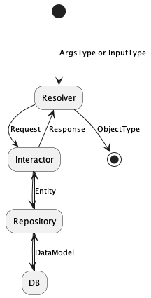
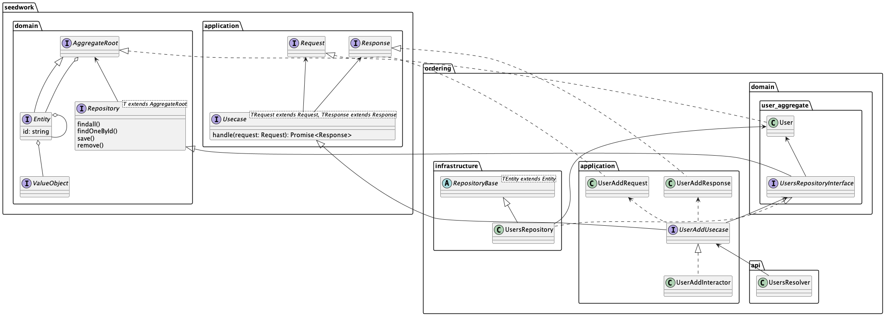
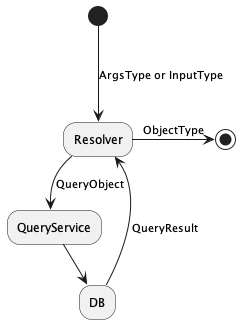

## What's this?

NestJS + GraphQL + TypeORM でのDDD Like なレイヤードアーキテクチャのサンプル。

## How to run

```bash
$ docker-compose up -d
$ yarn
$ yarn dev
```

http://localhost:3000/graphql

## Architecture

- ある程度レイヤーごとの詰め替えはする（Simple > Easy）
- ドメインモデルのデコレータ周りは効率化のため許容する（ドメインモデル = データモデル）
- CQRS にする

### Write Model (Lightweight Read Model)

基本はこっちを使う。





### Read Model

集計系など複雑なクエリが発生する場合はこっちを使う。




## TODO

1. AutoMapper をうまいことやる
2. args をうまいことやる
3. Read Model のパターンの実装
4. DomainService のパターン作る
5. 仮にOrdering としているが、コンテキストマッピングする
6. Date をISO 拡張形式にする

## References

- https://martinfowler.com/bliki/Seedwork.html
- https://github.com/dotnet-architecture/eShopOnContainers