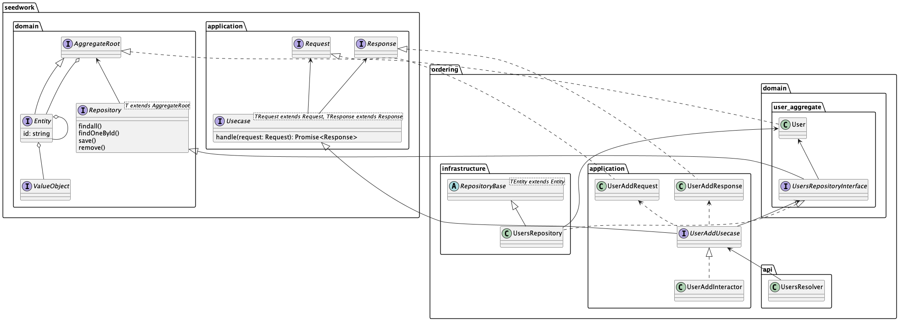
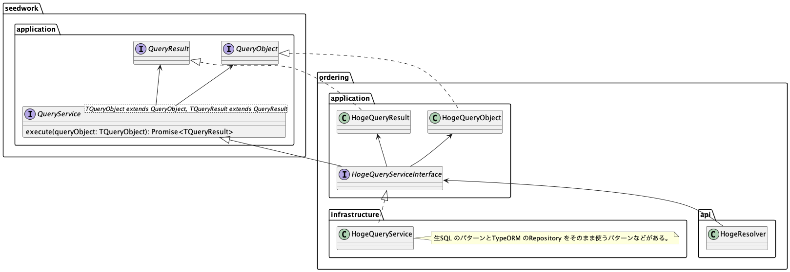

## What's this?

NestJS + GraphQL + TypeORM でのDDD Like なレイヤードアーキテクチャのサンプル。

## 方向性

- ある程度レイヤーごとの詰め替えはする。（Simple > Easy）
- ドメインモデルのデコレータ周りは効率化のため許容する（ドメインモデル = データモデル = GraphQL モデル）
- TODO: CQRS にする

## クラス図

### Write Model (Lightweight Read Model)

### Read Model

## TODO

- QueryService のパターン（集計系？）作る
- 仮にOrdering としているが、コンテキストマッピングする
- 別のコンテキストのModule も作ってAggregate する
- husky 入れる
- DomainService のパターン作る
- args をうまいことやる
- Date をISO 拡張形式にする
